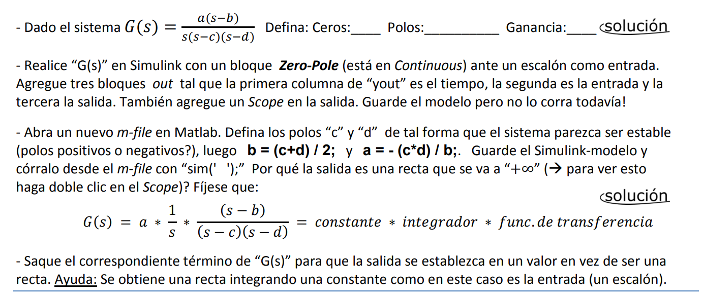

# Tema: 05. Características de sistemas lineales 

## Tabla de contenidos
### Guía 05
1. [Consigna 1](#guia-05-consigna-1)
2. [Consigna 2](#guia-05-consigna-2)
3. [Consigna 3](#guia-05-consigna-3)
4. [Consigna 4](#guia-05-consigna-4)

---

# Tema: 06. Errores y ayuda en Matlab y Simulink

## Tabla de contenidos
### Guía 06
1. [Consigna 1](#guia-06-consigna-1)
2. [Consigna 2](#guia-06-consigna-2)
3. [Consigna 3](#guia-06-consigna-3)
3. [Consigna 4](#guia-06-consigna-4)

---

## Guia 5: Consigna 1



### Definicion de polos y ceros

Observamos que el sistema G(s) tiene un cero en 'b', polos en 0, 'c' y 'd', y una ganancia 'a'.

### Diagrama en bloque del sistema

Realizamos el diagrama en bloque en Simulink,


### Definición de parámetros en un Script

Definí los valores de los polos, de manera que el sistema sea estable.

#### Codigo Marlab
```
% Definición de polos y ceros
c = -1;
d = -2;
b = (c+d)/2;
a = -(c*d)/b;

sim('mod_05')
[t,x,y]=sim('mod_05')
```


La simulación mostró valores de tiempo junto con sus respectivas entradas y salidas en el Command Window, confirmando que la salida crece indefinidamente. Esto también se observó en el Scope de Simulink.  

La causa es que el sistema es **tipo 1** (con un polo en el origen) y responde a una entrada escalón con una constante estática de posición Kp infinita, lo que impide que se estabilice en un valor finito.


